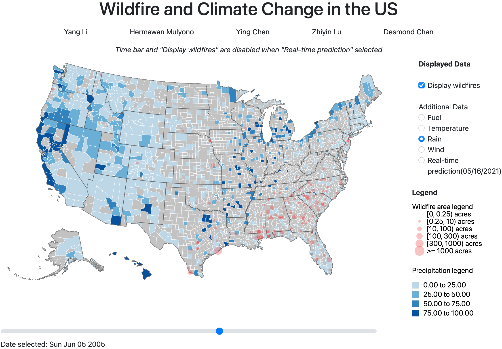

# Description

This project is the source code for Wildfire and Climate Change in US by Group 4 - Asia Pacific.
With this project, it is possible to visualize historical wildfire data from 1992 to 2015.
Moreover, some other factors that may affect wildfires are included, such as fuel, temperature,
rain and wind. Finally, we included prediction results of our machine learning model.

Webapp screenshot:



# System Requirements

To run this code example, you will need the following Python packages. It can be installed
with `pip install -r requirements.txt`. The requirements.txt file can be found in the CODE folder.

Module           | Version |
-----------------|---------|
`pandas`         | 1.1.3   |    
`flask`          | 1.1.2   | 
`flask-socketio` | 4.3.1   |
`numpy`          | 1.19.1  |


# Quick Start

Before running the code, make sure you download these datasets:
 1. `FPA_FOD_20170508.sqlite` wildfire data in `dataset/wildfire/FPA_FOD_20170508.sqlite`. This file can be downloaded from Kaggle
[here](https://www.kaggle.com/rtatman/188-million-us-wildfires).
 2. The rest of the `datasets` folder can be downloaded [here](https://1drv.ms/u/s!An2FrTaQfEmmmIQZmdWqCj0b-upwFQ?e=pvm2UY).
 
The `datasets` folder structure should be
```
datasets
   ├── fuel_moisture
   │   └── nfmd_compiled.csv
   ├── mlpreds
   │   └── ml_output.csv
   ├── temperature_and_precipitation
   │   └── tp_zipcode_county.csv
   ├── wildfire
   │   └── FPA_FOD_20170508.sqlite
   └── wind
       └── wind_with_fips.csv
```

To run the code, from this directory, type `python3 main.py`.
Then, on a browser, go to `127.0.0.1:8080`.

# API
Weather forest data requires Professional Plan from weatherstack:
https://weatherstack.com/

# Run machine learning procedure
At app directory, run
python3 api_download_ml.py

It will create a new ml_output.csv file in the datasets/mlpreds directory based on current datas' condition. This should be add as a daily procedure step on the application server.


